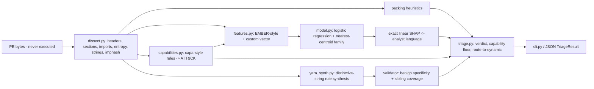

# VITRINE

**Static-first PE triage that explains its verdicts and writes the YARA rule for you — without ever running the sample.**

Most student malware classifiers stop at `predict() -> 0.87`. That number doesn't help an analyst decide anything. VITRINE parses a PE file (headers, sections, imports, entropy, strings), tags capabilities with capa-style rules mapped to ATT&CK, and scores it with a model whose attributions are exact. It then says in plain language which artifacts drove the score and generates a candidate YARA rule. It also checks that rule against a benign corpus (specificity) and against known family samples (coverage). Packed samples starve static features, so VITRINE routes them to dynamic analysis instead of guessing.

> **Lab-only.** VITRINE only reads bytes; it never loads, maps, or executes a file. The repo ships **no malware**. Every test fixture is a synthetic, inert PE built in code (`vitrine/synth.py`) whose "code" section is filler bytes. If you analyze real samples, do it inside an isolated, offline lab VM. See [SECURITY.md](SECURITY.md) and [THREAT_MODEL.md](THREAT_MODEL.md).

## Quickstart

```bash
python -m pip install -e ".[dev]"   # runtime is pure stdlib; pytest for tests
make test                            # or: python -m pytest -q
make demo                            # or: python -m vitrine demo
```

CLI:

```bash
vitrine gen-corpus corpus/ -n 10                 # write synthetic inert PEs, labeled by family
vitrine train --out vitrine_model.json           # train on synthetic corpus, print held-out P/R/F1/FPR
vitrine analyze corpus/injector/injector_0030.exe.vitrine \
    --model vitrine_model.json --benign-dir corpus/benign --siblings-dir corpus/injector [--json]
```

Example output (demo, section 1):

```
verdict  MALICIOUS  score=0.990  family=injector
top drivers:
  +1.528  6 injection/hooking/download-related APIs imported
  +0.658  capability 'process injection (remote thread)' (T1055.002) present: 1
capabilities:
  [T1055.002] process injection (remote thread): import CreateRemoteThread, import WriteProcessMemory, ...
yara: specificity=1.0 coverage=1.0
rule vitrine_injector_c58a0c65 { strings: $s0 = "VTRN_FAMILY_INJ_marker_7Q" ascii ... condition: uint16(0) == 0x5A4D and 2 of them }
```

## Architecture



| Module | What it does |
| --- | --- |
| `models.py` | Typed contracts: `PEReport`, `Section`, `Capability`, `Attribution`, `YaraRule`, `TriageResult`, `Verdict` |
| `dissect.py` | Pure-stdlib, bounds-checked PE32/PE32+ parser (imports, sections, entropy, strings, imphash, anomalies); packing heuristics |
| `capabilities.py` | Declarative capability rules (injection, download, keylogging, dynamic API resolution, and others) with evidence |
| `features.py` | 21-dim feature vector, each feature with an explanation template |
| `model.py` | L2 logistic regression (pure Python). Attribution `w_i * z_i` is exact SHAP for a linear model with a mean baseline. Nearest-centroid family |
| `yara_synth.py` | Picks strings shared by ≥60% of the family and absent from the benign corpus. Skips PE-header artifacts and treats generic API names as filler only. Emits YARA with an `N of them` condition. Includes a native matcher, plus an optional `yara-python` compile check |
| `triage.py` | Runs the pipeline. A low ML score cannot clear a sample when high-risk capabilities are present (the verdict is floored at SUSPICIOUS). Packed or SUSPICIOUS samples are routed to dynamic analysis |
| `synth.py` | Builds valid PE32 files with a real import table. Families: benign, injector, downloader, keylogger, packed. Also includes an adversarial "append benign section + pad imports" perturbation |

## Findings the demo shows (honest)

- On synthetic data the verdict model scores F1 = 1.0 on held-out samples. That result is easy by construction; it is not a real-world claim.
- **Adversarial:** adding a large benign section and padding GUI imports drops the injector's ML score from 0.99 to about 0.0. It is a complete evasion of the feature-space model. The capability rule (T1055.002) still fires, so the triage verdict is floored to SUSPICIOUS and the sample is routed to dynamic analysis. This matches the spec's thesis that imphash and capability features cost more to evade than statistical ones.
- **Generic API names in auto-YARA rules** (for example `GetProcAddress`) caused cross-family false matches (a packed-family rule matched injectors). The synthesizer now uses them only as filler.

## Prior art and how this differs

| Tool | Gap VITRINE targets |
| --- | --- |
| EMBER / PE-malware ML | Gives a score only. VITRINE attributes each verdict to artifacts and emits a rule |
| yarGen / YARA-Signator | Picks strings by frequency, with no verdict or explanation. VITRINE validates specificity and coverage per rule |
| capa / PEframe / pefile | Capabilities without an ML verdict or rule synthesis. VITRINE uses capabilities as features *and* as an evasion-resistant verdict floor |
| VirusTotal | Opaque and cloud-based. VITRINE is local, offline and explainable |

VITRINE's contribution is chaining these into one explainable, static-only pipeline. It is complementary to dynamic sandboxes such as SentinelCore: VITRINE decides *what deserves* detonation.

## Status / TODO (Grade C/D/E items deferred)

- [ ] **C:** Train on EMBER / SOREL-20M feature sets (needs a dataset download and a mapping to EMBER's feature schema).
- [ ] **B→C:** Swap in XGBoost + TreeSHAP. The `Attribution` contract stays the same. Also HDBSCAN family clustering over embeddings; nearest-centroid is the current stand-in.
- [ ] **C/D:** A full adversarial-robustness evaluation (a perturbation suite, robustness curves per feature group). Currently there is one perturbation plus the capability floor.
- [ ] **D:** Real-sample lab handling (MalwareBazaar in an offline VM). Deliberately not done here.
- [ ] **B:** FastAPI service and a React analyst triage UI with a rule editor.
- [ ] **A:** Byte-sequence YARA atoms from code sections (capstone), resources and exports parsing, and PE32+ fixtures.

## Layout

```
vitrine/      package (stdlib only)
tests/        pytest suite (synthetic fixtures only)
Makefile      make test | make demo
.github/workflows/ci.yml
```
