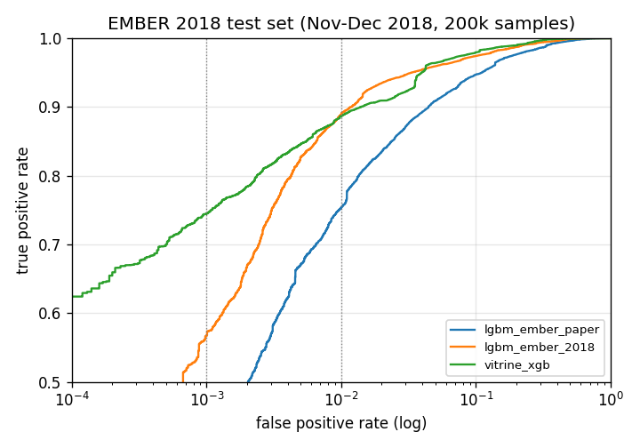
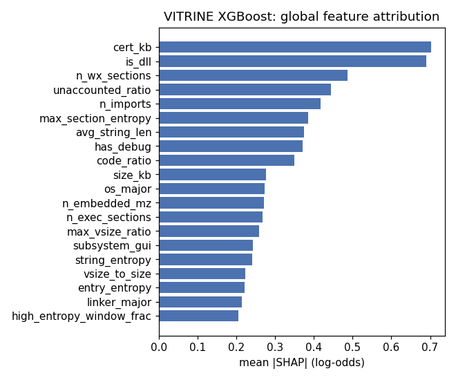
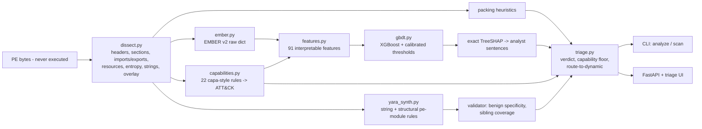

# VITRINE

[](https://github.com/rakshit-737/vitrine/actions/workflows/ci.yml)

[](LICENSE)


**Static-first PE triage that explains every verdict and writes a candidate YARA rule, without ever running the sample.**

A bare `predict() -> 0.87` doesn't help an analyst decide anything. VITRINE parses a PE file (headers, sections, imports, exports, resources, entropy, strings, overlay), tags capabilities with 22 capa-style rules mapped to ATT&CK, and scores the file with an XGBoost model trained on **EMBER 2018**. Exact TreeSHAP ties the score to named artifacts, which VITRINE reports in plain language. It then synthesizes a `pe`-module YARA rule and validates it against a benign corpus for specificity and against held-out family siblings for coverage. Packed samples starve static features, so VITRINE routes them to dynamic analysis instead of guessing.

> **Lab-only, no malware in this repo.** VITRINE only reads bytes and never loads, maps or executes a file. All training and evaluation uses EMBER's **pre-extracted features** (JSON, no binaries). Test fixtures are synthetic inert PEs built in code (`vitrine/synth.py`) plus a 75 KB sample of EMBER feature records. The real-benign benchmark reads `C:\Windows\System32` in place, read-only. See [SECURITY.md](SECURITY.md), [THREAT_MODEL.md](THREAT_MODEL.md) and [ADR 0001](docs/adr/0001-static-only-no-live-malware.md).

## Headline results (real data, reproducible)

All numbers come from committed JSON in [`results/`](results/) and were produced by the scripts in [`scripts/`](scripts/). EMBER 2018 uses a **temporal split**: training on Jan–Sep 2018, calibration on Oct 2018 (held out), and testing on **200,000 samples first seen Nov–Dec 2018**. Thresholds are chosen on the validation month, so the test FPR/TPR are honest out-of-time numbers.

### 1. Verdict model vs. the EMBER LightGBM baseline

| Model | Features | Train rows | ROC AUC | TPR @ 1 % FPR | TPR @ 0.1 % FPR | Test FPR / recall at the val-calibrated 1 % threshold |
| --- | --- | --- | --- | --- | --- | --- |
| **VITRINE XGBoost** (600 trees, depth 10) | **91 named** | 275,732 | **0.9917** | **88.7 %** | **74.5 %** | 0.89 % / 87.8 % (precision 99.0 %) |
| LightGBM, EMBER-paper config (100 trees, 31 leaves) | 2,381 hashed | 150,000* | 0.9797 | 75.4 % | 38.9 % | 0.90 % / 74.3 % |
| *Published:* EMBER paper LightGBM on **EMBER 2017** [1] | 2,351 | 600k labeled | 0.9991 | 98.2 % | 93.0 % | n/a (different, easier dataset) |



\* The baseline was trained on a 150k-row random subsample because the full 275k × 2381 float32 matrix did not fit in memory next to everything else on a 16 GB laptop. Treat it as a *reproduced reference point*, not as the best LightGBM result possible. EMBER 2018 was deliberately built to be harder than 2017, and public default-parameter LightGBM runs on EMBER 2018 report about 0.985 AUC [3]. Tuned 2018 parameters (`num_leaves=2048`, many more rounds) score higher. That run (`lgbm_ember_2018` in `train_ember.py`) did not finish on this hardware, so no number is claimed for it.

**Cost of interpretability:** none measured against this baseline. The 91 human-readable features beat the reproduced 2,381-dim hashed baseline on every metric. They also give SHAP attributions that turn into analyst sentences ([ADR 0003](docs/adr/0003-interpretable-features-plus-treeshap.md)).

**SHAP faithfulness** (2,000 test malware):

| Check | Result |
| --- | --- |
| Additivity: max \|Σ SHAP − margin\| | 1.7e-5 log-odds, so the contributions are exact |
| Deletion test: replace the top-k SHAP features with the benign median | score drop 0.087 / 0.224 / 0.335 / 0.532 for k = 1 / 3 / 5 / 10 |
| Same, but k *random* features | 0.003 / 0.008 / 0.009 / 0.019. SHAP picks the features that actually drive the score, 18–37× better than random |



**Packing routing rationale:** 20.8 % of the test set trips the packing heuristics, and 75 % of those samples are malicious. AUC on the packed subset is 0.9965 (XGB) / 0.9905 (LGBM). The packed flag is therefore a strong *prior*, but packed benign files (installers, protected software) are exactly where static evidence runs out, which is why VITRINE routes them to dynamic analysis.

### 2. Auto-YARA on real families (15 most frequent AVClass families)

Structural rules (imports, section names, imphash through YARA's `pe` module) are synthesized from 400 training samples per family and tuned against the training benign pool. Every rule is then scored on out-of-time test siblings, **all 100,000 test benign** samples and **2,999 real System32 binaries**.

| Rule generator | Rules emitted | Mean coverage (families with a rule) | Coverage (all 15 families) | Benign FPs (100k EMBER test) | FPs on System32 | Cross-family hit rate |
| --- | --- | --- | --- | --- | --- | --- |
| **VITRINE structural** | 8 / 15 (abstains on 7) | **31.5 %** | 16.8 % | **5** (specificity 99.9994 %) | **0** | 0.005 % |
| Exact-imphash baseline | 15 | 21.0 % | 21.0 % | 11,596 | 0 | 0.18 % |
| Frequency baseline (yarGen-like, no benign filter) | 15 | 20.4 % | 20.4 % | 55,112 | 297 | 2.9 % |

When a family has distinctive structure, the rule works: xtrat **97.7 %** and sivis **98.9 %** sibling coverage with 0 benign hits. When a family doesn't (zbot, sality, emotet, upatre and others), VITRINE **abstains** instead of shipping a noisy rule. The baselines emit rules that either miss or light up thousands of benign files. Rules are in [`results/rules/ember2018_families.yar`](results/rules/ember2018_families.yar).

### 3. Adversarial robustness (feature-space, 3,000 test malware)

Functionality-preserving edits are simulated on the EMBER raw features, with donor content taken from real benign samples ([ADR 0005](docs/adr/0005-adversarial-eval-in-feature-space.md)). The table shows detection rate at the validation-calibrated 1 % FPR threshold.

| Perturbation | VITRINE XGB | LightGBM baseline | VITRINE triage (score **or** high-risk capability floor) |
| --- | --- | --- | --- |
| none | 87.1 % | 74.1 % | 89.4 % |
| append benign PE as overlay | 78.6 % | 63.8 % | 82.3 % |
| add benign data section | 75.1 % | 63.0 % | 78.6 % |
| import padding (benign donor) | 77.1 % | 60.2 % | 85.5 % |
| copy benign header fields | 79.2 % | 70.2 % | 82.3 % |
| **all combined** | **40.2 %** | **37.1 %** | **58.9 %** |

Honest reading: both models are badly hurt by a combined attack. The capability floor retains more detections because capability rules need the *malicious* imports to disappear, and padding can't remove them. The floor has a price, though. On EMBER's raw features it flags **10.9 % of benign** test files for review, more than its 8.6 % hit rate on malware. As a *standalone* signal it isn't discriminative, and it is only useful as a "don't auto-clear" floor in front of an analyst queue.

### 4. Family clustering (5,000 malware, 10 AVClass families)

| Embedding | Algorithm | Clusters | Noise | ARI | NMI | Homogeneity | Purity |
| --- | --- | --- | --- | --- | --- | --- | --- |
| 91 interpretable feats → PCA20 | HDBSCAN | 40 | 33.6 % | 0.578 | 0.772 | 0.968 | 0.977 |
| 91 interpretable feats → PCA20 | k-means (k = true 10) | 10 | 0 | 0.478 | 0.624 | 0.601 | 0.674 |
| EMBER 2381 → SVD20 | HDBSCAN | 31 | 32.7 % | 0.660 | 0.800 | 0.961 | 0.977 |
| EMBER 2381 → SVD20 | k-means (k = true 10) | 10 | 0 | 0.246 | 0.505 | 0.448 | 0.516 |

HDBSCAN finds **very pure** clusters (about 97 % single-family) by over-splitting families into variants and refusing to label a third of the samples. That is the right behavior for a per-cluster rule generator. AVClass labels are noisy consensus labels, so these are agreement scores rather than accuracy.

### 5. Real benign binaries (domain-shift check)

This benchmark takes 3,000 random PE files from this machine's `C:\Windows\System32` (2026-era Windows 11) and parses them **with VITRINE's own dissector, not LIEF**. It then scores them with models trained on 2018 LIEF features. Every flag is a false positive.

| | Result |
| --- | --- |
| Parsed | 2,999 / 3,000 (1 over the size cap), median 168 KB |
| VITRINE XGB false positives at the 1 % / 0.1 % thresholds | **0 / 0** (mean score 0.0005) |
| LightGBM baseline false positives | 0 / 0 (mean score 0.012) |
| Triage verdicts | 0 MALICIOUS, 0 SUSPICIOUS by score, **102 (3.4 %) SUSPICIOUS by capability floor**, 2,897 BENIGN |
| Most frequent capability hits | anti-debug API (T1622) 70 %, registry modification (T1112) 41 %, memory-protection changes (T1055) 11 % |

The extractor swap and 8 years of drift do not produce false positives on signed Microsoft binaries. This is an easy benign set, though: every file is signed and well-formed. The capability floor is the component that pays the price here, since OS binaries legitimately import debugging and memory APIs.

## Architecture



| Module | Role |
| --- | --- |
| `dissect.py` | Pure-stdlib, bounds-checked PE32/PE32+ parser: 8-byte thunks, ordinal and delay imports, exports, resources, data directories, overlay, imphash, anomalies. Agrees with `pefile` on 500/500 System32 import/export tables |
| `capabilities.py` | 22 declarative capability rules (injection, hooking, credential access, anti-debug, persistence, ...) with ATT&CK IDs, A/W-agnostic API matching and evidence |
| `ember.py` | Bytes → EMBER v2 raw-feature dict (no LIEF), plus a clean-room batch implementation of the 2,381-dim v2 vectorizer (~30× faster than the per-sample loop) |
| `features.py` | 91 named features computed from EMBER raw dicts, each with a sentence template |
| `gbdt.py` | XGBoost verdict model, exact TreeSHAP (`pred_contribs`), validation-calibrated 1 % / 0.1 % FPR thresholds, nearest-centroid family |
| `model.py` | Dependency-free logistic regression with exact linear SHAP, used for CI and the synthetic demo |
| `yara_synth.py` | String rules (family-shared, benign-absent strings) and structural `pe`-module rules (imports, section names, imphash) with native validation and an optional `yara-python` compile check |
| `triage.py` | Pipeline and verdict policy: MALICIOUS / SUSPICIOUS / BENIGN, capability floor, route-to-dynamic |
| `api.py` + `static/index.html` | FastAPI (`/api/analyze`, `/api/yara/validate`, `/api/model`, `/health`) and a single-file analyst UI |
| `synth.py` | Inert synthetic PE32/PE32+ builder used by tests and the demo |

## Quickstart

```bash
python -m pip install -e ".[dev]"      # numpy core; dev pulls sklearn, xgboost, fastapi, pytest, ruff
python -m pytest -q                     # 40 tests; realdata tests skip when the dataset is absent
python -m vitrine demo                  # end-to-end on synthetic inert samples
```

Triage real files (read-only) with a trained model:

```bash
python -m vitrine analyze C:/Windows/System32/notepad.exe --model <data>/models/vitrine_xgb.json
python -m vitrine scan C:/Windows/System32 --model <data>/models/vitrine_xgb.json > verdicts.jsonl
python -m vitrine serve --model <data>/models/vitrine_xgb.json   # http://127.0.0.1:8000
docker compose up                                                # same API, hardened container
```

Real output on this machine's `notepad.exe` (EMBER-trained model, excerpt):

```
verdict  BENIGN  score=0.001  family=None
packed   False   route_to_dynamic=False
top drivers (SHAP, log-odds; + pushes toward malicious):
  -1.358  minimum OS major version 10
  -1.130  64-bit (PE32+) image: 1
  -1.062  4 exploit mitigations flagged in the header
  -0.807  Control Flow Guard enabled: 1
  -0.717  debug directory present: 1
capabilities:
  [T1106] create process: import CreateProcessW, import ShellExecuteW
  [T1622] anti-debugging checks: import IsDebuggerPresent, import OutputDebugStringW
  [T1112] registry modification: import RegCreateKeyW, import RegCreateKeyExW, import RegSetValueExW
```

## Reproducing the benchmarks

`make` targets exist, but every step is a plain command (this project was built on Windows without `make`):

```bash
pip install -e ".[dev,bench]"
python scripts/download_ember.py  --out D:/data/vitrine          # 1.7 GB, MD5 + SHA-256 verified, resumable
python scripts/prepare_ember.py   --data D:/data/vitrine         # stream -> 2381-dim f32 memmap + 91 features (~5.5 GB)
python scripts/train_ember.py     --data D:/data/vitrine --lgbm-limit 150000   # -> results/ember_benchmark.json
python scripts/merge_baselines.py --data D:/data/vitrine         # fold saved baseline scores in, redraw figures
python scripts/bench_yara.py      --data D:/data/vitrine --benign-dir C:/Windows/System32 --benign-limit 3000
python scripts/bench_adversarial.py --data D:/data/vitrine
python scripts/bench_cluster.py   --data D:/data/vitrine
python scripts/bench_benign.py    --data D:/data/vitrine --dir C:/Windows/System32 --limit 3000
VITRINE_DATA=D:/data/vitrine python -m pytest -q -m realdata   # real-data tests
```

Wall-clock on a contended 16 GB / 16-thread laptop: prep about 40 min, XGBoost about 12 min, the LightGBM paper-config baseline about 7 min, and the System32 scan about 36 min.

## Dataset

| Dataset | What | Size | Licence | Used for |
| --- | --- | --- | --- | --- |
| **EMBER 2018** (feature version 2) [2] | LIEF-extracted raw features of 1M PE files (800k train incl. 200k unlabeled, 200k test), AVClass family labels | 1.7 GB `.tar.bz2` (about 10 GB JSONL) | Data: MIT. `elastic/ember` code: AGPL-3.0 (not vendored; VITRINE's vectorizer is an independent implementation) | Training, calibration, test, auto-YARA, clustering, adversarial |
| Local Windows install (`C:\Windows\System32`) | Real, current benign PEs | read in place, nothing copied | Microsoft, not redistributed | Parser verification, benign specificity, domain shift |

No binaries, malicious or benign, are stored in the repo or the dataset folder.

## Prior art and how this differs

| Existing | What it does | VITRINE's angle |
| --- | --- | --- |
| EMBER / PE-malware ML [1,2] | Feature set and GBDT score | Named features and exact TreeSHAP sentences, calibrated out-of-time thresholds, triage policy |
| yarGen / YARA-Signator | Frequency-based rule generation | Benign-filtered, structural `pe` rules. Measured specificity and coverage on 100k benign, and abstention when no rule is safe |
| capa (Mandiant), PEframe | Capability detection | Capabilities used as model features *and* as an evasion-resistant "don't auto-clear" floor |
| VirusTotal | Cloud multi-AV | Local, offline, explainable |

VITRINE's contribution is **chaining these into one static-only pipeline and measuring each link on real data**. It complements dynamic sandboxes: VITRINE decides *what deserves* detonation.

## Limitations

- **No live samples by design.** Real-file scoring is validated only on benign binaries. Malware performance comes from EMBER's LIEF-extracted features, and VITRINE's own extractor differs from LIEF in small ways ([ADR 0002](docs/adr/0002-own-extractor-emits-ember-schema.md)).
- **Temporal drift.** EMBER stops in 2018. The model is a 2018 detector and needs retraining on modern features (for example EMBER2024) for real use.
- The LightGBM baseline is a memory-limited reproduction (150k rows, 100 trees). The published 2017-set numbers are shown only for context.
- The adversarial evaluation works in feature space. It bounds what naive edits can do, and it is not a problem-space attack on real binaries.
- YARA structural rules abstain on about half the families. String and byte-sequence atoms from code sections (capstone) are not implemented.
- The capability floor is not discriminative on its own (sections 3 and 5).

## Roadmap

- [ ] Train and evaluate on EMBER2024 / SOREL-20M features (temporal generalisation to 2024).
- [ ] Problem-space adversarial evaluation on benign binaries (secml-malware style section and overlay injection).
- [ ] Capstone byte-sequence atoms for YARA, plus a yarGen-style goodware string DB.
- [ ] Per-cluster (HDBSCAN) rule generation instead of per-AVClass-family.
- [ ] A tuned full-data LightGBM 2018 baseline on a bigger machine.

## Repository layout

```
vitrine/         package (dissector, features, models, YARA, triage, API, UI)
scripts/         download / prepare / train / bench (real data lives outside the repo)
results/         committed benchmark JSON + synthesized rules
docs/adr/        architecture decision records
docs/figures/    ROC and SHAP figures
tests/           pytest (synthetic inert PEs + 75 KB EMBER fixture; @realdata tests skip without data)
```

See [CHANGELOG.md](CHANGELOG.md), [CONTRIBUTING.md](CONTRIBUTING.md) and [docs/adr/](docs/adr/).

## References

1. H. S. Anderson, P. Roth. *EMBER: An Open Dataset for Training Static PE Malware Machine Learning Models.* arXiv:1804.04637, 2018. EMBER 2017 LightGBM: AUC 0.99911, 92.99 % TPR at 0.1 % FPR, 98.2 % at 1 % FPR.
2. EMBER 2018 feature-version-2 release, <https://github.com/elastic/ember>. P. Roth, *EMBER Improvements*, CAMLIS 2019.
3. Public EMBER 2018 v2 LightGBM notebook reporting about 0.985 AUROC, <https://www.kaggle.com/code/dhoogla/ember-2018-v2f-lgbm-0-985-auroc>.
4. Mandiant capa, <https://github.com/mandiant/capa>. Neo23x0 yarGen, <https://github.com/Neo23x0/yarGen>.

## License

MIT, see [LICENSE](LICENSE). For authorized, lab-only research and education.
