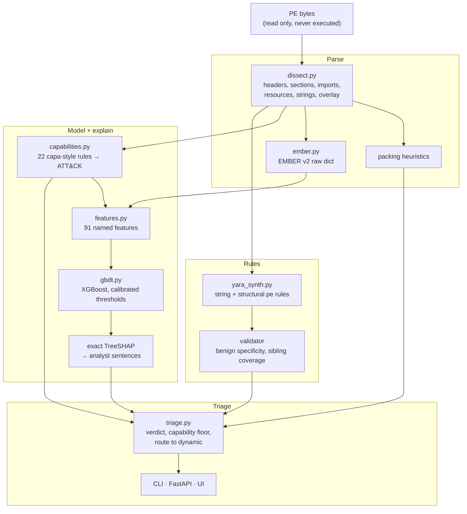

# VITRINE

[](https://github.com/rakshit-737/vitrine/actions/workflows/ci.yml)

[](LICENSE)

[](https://rakshit-737.github.io/vitrine/)

**Static-first PE triage that explains every verdict and writes a candidate YARA rule, without ever running the sample.**

**Novel contribution:** an explainable static triage pipeline whose 91 *named* features make temporal drift measurable and give a ranked hypothesis about its source: trained on EMBER 2018 and tested on EMBER2024, it loses 0.018 AUC and, at its own calibrated threshold, 29 pt of recall while its false-positive rate *falls* (silent decay), and, among features defined identically in both schemas, a drift-weighted ranking (PSI x mean|SHAP|; correlational, and extractor change is not isolated) points to benign-only selection artifacts (DLL share, signing) and both-class toolchain artifacts (import count, OS and linker versions, size); dropping them does not recover robustness. The top raw-PSI feature, `n_embedded_mz`, is a schema-definition change, not drift (PSI 8.9 between its v2 and v3 definitions on the same System32 files) ([Evaluation §2](https://rakshit-737.github.io/vitrine/evaluation/#2-cross-time-ember-2018-ember2024), AUC and TPR figures with bootstrap CIs over 3 seeds; the 29 pt recall drop is a 3-seed mean and the PSI 8.9 is one 600-file sample, neither bootstrapped).

[](https://rakshit-737.github.io/vitrine/demo/)

VITRINE parses a PE file (headers, sections, imports, exports, resources, entropy, strings, overlay), tags capabilities with 22 capa-style rules mapped to ATT&CK, and scores it with an XGBoost model trained on EMBER 2018 features. Exact TreeSHAP turns the score into plain-language reasons. It then synthesizes a `pe`-module YARA rule, validates it against benign files and held-out family siblings, and abstains when no safe rule exists. Packed files are routed to dynamic analysis.

> **Lab-only, no malware in this repo.** VITRINE only reads bytes and never loads, maps or executes a file. All training and evaluation uses EMBER's **pre-extracted features** (JSON, no binaries). Test fixtures are synthetic inert PEs built in code plus small samples of EMBER feature records. See [SECURITY.md](SECURITY.md), [THREAT_MODEL.md](THREAT_MODEL.md) and [ADR 0001](docs/adr/0001-static-only-no-live-malware.md).

## Try it in 60 seconds

1. **No install:** open the [static demo](https://rakshit-737.github.io/vitrine/demo/) (precomputed: synthetic samples plus real System32 files scored by the EMBER model).
2. **pip** (numpy only):
   ```bash
   pip install https://github.com/rakshit-737/vitrine/releases/download/v1.1.0/vitrine-1.1.0-py3-none-any.whl
   vitrine demo
   ```
   ```text
   == VITRINE demo (synthetic inert PEs only) ==
   -- 1. explainable verdict: injector --
   verdict  MALICIOUS  score=0.989  family=injector
     +0.887  1 high-risk capability rule(s) matched (injection/download/keylogging)
     +0.801  4 injection API(s) imported
   ```
3. **Docker** (API + UI on localhost only):
   ```bash
   docker run --rm -p 127.0.0.1:8000:8000 ghcr.io/rakshit-737/vitrine:v1.1.0   # http://127.0.0.1:8000
   ```

## Headline results

Full methodology, every table and all intervals: **[Evaluation](https://rakshit-737.github.io/vitrine/evaluation/)**. Exact commands, outputs and runtimes: **[Reproduce](https://rakshit-737.github.io/vitrine/reproduce/)**. Every number below is in a committed file under [`results/`](results/). Numbers that got worse in this revision are marked **(worse)**.

**Data and subsampling.** EMBER 2018 training uses a deterministic **50 % sha256-prefix subsample** of the 600k labelled rows (`--train-frac 0.5`, to fit 16 GB RAM): 275,732 rows to fit after holding out 2018-10 for calibration; test = all 200,000 Nov-Dec 2018 files. EMBER2024 (Win32) is a sha256-range subsample of about 7 % of every week: 135,423 files over 64 weeks.

| Result | Value (95 % CI) | Source |
| --- | --- | --- |
| VITRINE XGBoost on EMBER 2018 test (mean of 3 seeds) | AUC 0.9913; TPR 88.3 % @ 1 % FPR, 74.1 % @ 0.1 % FPR | `ember_ci.json` |
| **(worse)** vs the EMBER authors' *published* 2018 model, same test rows | AUC −0.0047 (−0.0049, −0.0045); −7.8 pt @ 1 %; −12.7 pt (−14.4, −11.2) @ 0.1 % | `ember_published.json` |
| Published 2018 model, our reproduction of its score | AUC 0.9964, 96.5 % / 87.0 % (authors' notebook: 0.9964, 96.5 % / 86.8 %) | `ember_published.json` |
| EMBER2024 released Win32 model scored on our test subsample (not the full published setup; paper config retrained only on ~4 % of rows) | AUC 0.9983 (0.9980-0.9985); paper 0.9984 | `ember2024_baselines.json` |
| 2018 model → 2024 test | AUC 0.9730 (0.9710-0.9748); recall at 2018 threshold 58.6 % (was 88.0 %), FPR 0.07 % | `ember2024_drift.json` |
| 2024 model → 2018 test | AUC 0.8860 (0.8810-0.8895); 44.8 % FPR at its own threshold | `ember2024_drift.json` |
| Auto-YARA, 15 families, out of time | VITRINE 16.8 % coverage, 5 FPs / 100k benign; benign-filtered imphash baseline 13.9 %, 7 FPs | `yara_structural.json` |
| Real System32 binaries (2026) | 0 / 2,999 score false positives (upper bound 0.1 %) | `benign_system32.json` |
| **(worse)** Capability floor under combined feature-space attack | 58.7 % detection, but 13 pt of it switched on by benign donors; 47.1 % with clean donors; floor costs 11.7 % benign FPR | `adversarial.json` |

The earlier claims "the cost of interpretability is small" and "clearly ahead at 0.1 % FPR" held only against our 150k-row LightGBM reproductions and are withdrawn; the published model is clearly better at detection. VITRINE's value is the explanation, rule synthesis and drift diagnosis around a competitive (not state-of-the-art) score.


## Architecture



| Module | Role |
| --- | --- |
| `dissect.py` | Pure-stdlib, bounds-checked PE32/PE32+ parser: 8-byte thunks, ordinal and delay imports, exports, resources, data directories, overlay, imphash, anomalies. Import/export tables checked against `pefile` on System32 DLLs (`tests/test_ember.py`, run on Windows CI) |
| `capabilities.py` | 22 declarative capability rules (injection, hooking, credential access, anti-debug, persistence, ...) with ATT&CK IDs, A/W-agnostic API matching and evidence |
| `ember.py` | Bytes → EMBER v2 raw-feature dict (no LIEF), plus a clean-room batch implementation of the 2,381-dim v2 vectorizer |
| `features.py` | 91 named features computed from EMBER raw dicts, each with a sentence template |
| `gbdt.py` | XGBoost verdict model, exact TreeSHAP (`pred_contribs`), validation-calibrated 1 % / 0.1 % FPR thresholds, nearest-centroid family |
| `model.py` | Dependency-free logistic regression with exact linear SHAP, used for CI and the synthetic demo |
| `yara_synth.py` | String rules (family-shared, benign-absent strings) and structural `pe`-module rules (imports, section names, imphash) with native validation and an optional `yara-python` compile check |
| `triage.py` | Pipeline and verdict policy: MALICIOUS / SUSPICIOUS / BENIGN, capability floor, route-to-dynamic |
| `api.py` + `static/index.html` | FastAPI (`/api/analyze`, `/api/yara/validate`, `/api/model`, `/health`) and a single-file analyst UI |
| `synth.py` | Inert synthetic PE32/PE32+ builder used by tests and the demo |

## Develop

```bash
git clone https://github.com/rakshit-737/vitrine && cd vitrine
python -m pip install -e ".[dev]"      # numpy core; dev adds sklearn, xgboost, fastapi, pytest, ruff
python -m pytest -q                     # realdata tests skip when the datasets are absent
python -m vitrine demo
```

Triage real files (read-only) with a trained model:

```bash
vitrine analyze C:/Windows/System32/notepad.exe --model <data>/models/vitrine_xgb.json
vitrine scan C:/Windows/System32 --model <data>/models/vitrine_xgb.json > verdicts.jsonl
vitrine serve --model <data>/models/vitrine_xgb.json   # http://127.0.0.1:8000 (loading the 18 MB model takes 20-60 s)
```

Real output on `notepad.exe` (EMBER-trained model, all tags shown):

```
verdict  BENIGN  score=0.001  family=None
top drivers (SHAP, log-odds; + pushes toward malicious):
  -1.358  minimum OS major version 10
  -1.130  64-bit (PE32+) image: 1
  -1.062  4 exploit mitigations flagged in the header
  -0.807  Control Flow Guard enabled: 1
  -0.717  debug directory present: 1
capabilities:
  [T1106] create process: import CreateProcessW, import ShellExecuteW
  [T1622] anti-debugging checks: import IsDebuggerPresent, import OutputDebugStringW
  [T1112] registry modification: import RegCreateKeyW, import RegCreateKeyExW, import RegSetValueExW
```

(A fourth tag, T1071.001 on the manifest's XML-namespace URL, was a false hit and is now filtered.)

## Datasets

| Dataset | What | Licence | Used for |
| --- | --- | --- | --- |
| **EMBER 2018** v2 [2] | LIEF-extracted features of 1M PE files (600k labelled train, 200k test), AVClass labels; ships the authors' benchmark model | Data MIT; `elastic/ember` code AGPL-3.0, not vendored | Training, calibration, test, YARA, clustering, adversarial |
| **EMBER2024** Win32 [3] | pefile/thrember features (v3) with capa and packer labels, weekly 2023-09 .. 2024-12 | Apache-2.0 | Cross-time drift, baseline reproduction, capability validation |
| Local `C:\Windows\System32` | Real current benign PEs, read in place | not redistributed | Parser checks, benign specificity |

## Prior art

| Existing | What it does | VITRINE's angle |
| --- | --- | --- |
| EMBER / EMBER2024 [1-3] | Feature sets and GBDT baselines | Named features, exact TreeSHAP sentences, calibrated thresholds, cross-time drift attribution |
| yarGen, AutoYara [4,5] | Rule generation from frequent strings/bytes | Structural `pe` rules, benign-filtered, with abstention; compared with benign-filtered baselines |
| capa [6] | Capability detection from code | Import-level rules used as features and a review floor; agreement with capa measured on EMBER2024 |
| TESSERACT [7] | Time-aware evaluation | Applied across two EMBER generations, with feature-level drift attribution |

## Limitations

- Detection is clearly below the published full-data EMBER 2018 model; the gap is not decomposed into data vs representation.
- 2018 → 2024 mixes temporal drift with collection, extractor (LIEF vs pefile) and schema-translation changes.
- EMBER2024 is a ~7 % per-week subsample; the EMBER 2017 paper setup (v1 features, LightGBM defaults) is reproduced exactly in Actions: AUC 0.99911 (0.99905-0.99917) vs 0.99911 published (`ember2017_repro.json`).
- Adversarial evaluation is in feature space, not on real binaries. The capability floor is not a useful detector.
- YARA rules abstain on half the families and four emitted rules barely generalise; byte-sequence atoms need binaries, which the safety rules exclude.

## Repository layout

```
vitrine/   package (dissector, features, models, YARA, triage, API, UI)
scripts/   download / prepare / train / bench (data lives outside the repo)
results/   committed result JSON + synthesized rules
docs/      MkDocs site, ADRs, figures
paper/     preprint (LaTeX)
tests/     pytest (synthetic inert PEs + small EMBER feature fixtures)
```

See [CHANGELOG.md](CHANGELOG.md), [CONTRIBUTING.md](CONTRIBUTING.md), [CITATION.cff](CITATION.cff).

## References

1. H. S. Anderson, P. Roth. *EMBER: An Open Dataset for Training Static PE Malware Machine Learning Models.* arXiv:1804.04637, 2018.
2. EMBER 2018 feature-version-2 release and benchmark model, <https://github.com/elastic/ember>.
3. R. J. Joyce et al. *EMBER2024 - A Benchmark Dataset for Holistic Evaluation of Malware Classifiers.* KDD 2025, arXiv:2506.05074.
4. Neo23x0 yarGen, <https://github.com/Neo23x0/yarGen>.
5. E. Raff et al. *Automatic Yara Rule Generation Using Biclustering.* AISec 2020, arXiv:2009.03779.
6. Mandiant capa, <https://github.com/mandiant/capa>.
7. F. Pendlebury et al. *TESSERACT: Eliminating Experimental Bias in Malware Classification across Space and Time.* USENIX Security 2019, arXiv:1807.07838.

## License

MIT, see [LICENSE](LICENSE). For authorized, lab-only research and education. Built with AI assistance (Claude).
