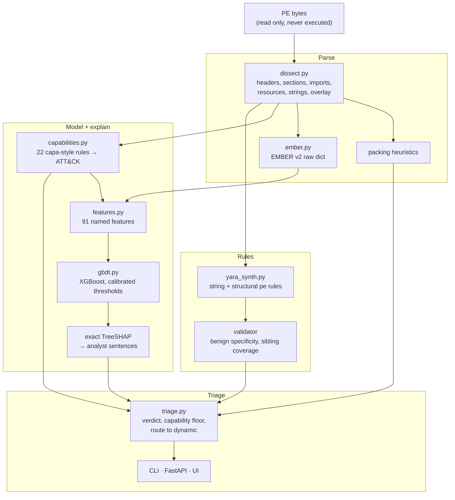

# Architecture

| Module | Role |
| --- | --- |
| `dissect.py` | Pure-stdlib, bounds-checked PE32/PE32+ parser: 8-byte thunks, ordinal and delay imports, exports, resources, data directories, overlay, imphash, anomalies. Import/export tables checked against `pefile` on System32 DLLs (`tests/test_ember.py`, run on Windows CI) |
| `capabilities.py` | 22 declarative capability rules (injection, hooking, credential access, anti-debug, persistence, ...) with ATT&CK IDs, A/W-agnostic API matching and evidence |
| `ember.py` | Bytes → EMBER v2 raw-feature dict (no LIEF), plus a clean-room batch implementation of the 2,381-dim v2 vectorizer |
| `features.py` | 91 named features computed from EMBER raw dicts, each with a sentence template |
| `gbdt.py` | XGBoost verdict model, exact TreeSHAP (`pred_contribs`), validation-calibrated 1 % / 0.1 % FPR thresholds, nearest-centroid family |
| `model.py` | Dependency-free logistic regression with exact linear SHAP, used for CI and the synthetic demo |
| `yara_synth.py` | String rules (family-shared, benign-absent strings) and structural `pe`-module rules (imports, section names, imphash) with native validation and an optional `yara-python` compile check |
| `triage.py` | Pipeline and verdict policy: MALICIOUS / SUSPICIOUS / BENIGN, capability floor, route-to-dynamic |
| `api.py` + `static/index.html` | FastAPI (`/api/analyze`, `/api/yara/validate`, `/api/model`, `/health`) and a single-file analyst UI |
| `synth.py` | Inert synthetic PE32/PE32+ builder used by tests and the demo |
