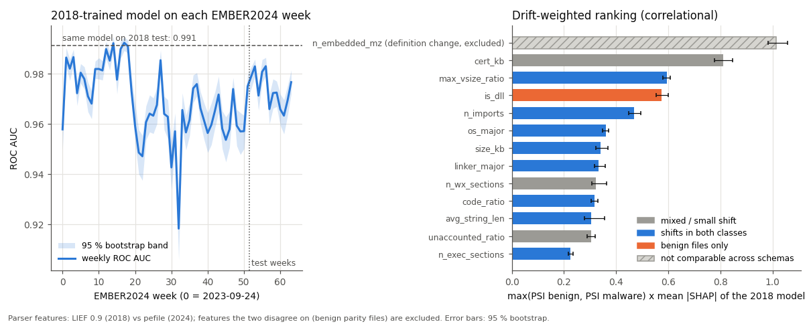

# Evaluation

All numbers come from committed JSON in [`results/`](https://github.com/rakshit-737/vitrine/tree/main/results),
produced by the scripts in [`scripts/`](https://github.com/rakshit-737/vitrine/tree/main/scripts); the
[Reproduce](reproduce.md) page lists the exact commands. Some numbers got worse in this revision; they
are marked **(worse)** and explained.

## Methodology

**Data.** EMBER 2018 (feature version 2) pre-extracted features, no binaries. Training uses a
deterministic **50 % sha256-prefix subsample** of the 600k labelled training rows
(`prepare_ember.py --train-frac 0.5`, chosen to fit 16 GB RAM): 319,336 rows; 2018-10 is held out
for calibration and 275,732 rows are used to fit (this includes 27,370 benign files first seen
2006-2017). The test set is all 200,000 labelled Nov-Dec 2018 files (50 % malware).
EMBER2024 (Win32, feature version 3) is a **sha256-range subsample** sized for bandwidth and RAM:
the first 8 MiB of each of the 64 weekly files (about 7 % of each week, 135,423 labelled files;
train weeks 0-51, test weeks 52-63). v3 records are translated to the v2 schema
(`vitrine/ember3.py`; approximations listed in `results/ember2024_drift.json`).

**Metrics.** ROC AUC; TPR at 1 % and 0.1 % FPR *read off the test ROC* (the literature's convention:
the threshold is picked on the test set); and FPR / recall at a threshold calibrated on held-out
data, which is what a deployed model would see. Precision figures assume the test set's 50 %
prevalence.

**Uncertainty.** 95 % stratified-bootstrap percentile intervals (1,000 resamples; 300 in the older
`ember_ci.json`), pooled over 3 training seeds where models were retrained, so they include seed
variance. Differences are paired (same resamples). Rates on fixed samples use Wilson intervals;
zero-event rates use the rule of three. Adversarial comparisons use exact McNemar tests.

## 1. Verdict model vs published and reproduced baselines (EMBER 2018)

| Model | Features | Train rows | ROC AUC (95 % CI) | TPR @ 1 % FPR | TPR @ 0.1 % FPR |
| --- | --- | --- | --- | --- | --- |
| **Published EMBER 2018 model** (authors' `ember_model_2018.txt`, 1,000 trees), scored by us on the same test rows | 2,381 hashed | all ~600k labelled (authors) | **0.9964** (0.9962-0.9966) | **96.5 %** | **87.0 %** (86.0-88.8) |
| VITRINE XGBoost (600 trees, depth 10), seed 0 | 91 named | 275,732 (50 % subsample) | 0.9917 (0.9915-0.9920) | 88.7 % | 74.5 % (73.3-75.7) |
| VITRINE XGBoost, mean ± sd of 3 seeds | 91 named | 275,732 | 0.9913 ± 0.0007 | 88.3 ± 0.3 % | 74.1 ± 0.4 % |
| LightGBM, EMBER-2018 config, 300 rounds (our run) | 2,381 hashed | 150,000 | 0.9901 (0.9898-0.9905) | 89.0 % (88.2-89.4) | 56.8 % (53.2-59.0) |
| LightGBM, paper defaults, 100 trees (our run) | 2,381 hashed | 150,000 | 0.9797 | 75.4 % | 38.9 % |
| *Published, EMBER 2017 paper* [1], different dataset | 2,351 | 600k | 0.9991 | 98.2 % | 93.0 % |

Paired difference VITRINE XGB − published model (bootstrap 95 % CI): **AUC −0.0047 (−0.0049, −0.0045);
TPR @ 1 % −7.8 pt (−8.3, −7.5); TPR @ 0.1 % −12.7 pt (−14.4, −11.2)** (`results/ember_published.json`).
Our score for the published model reproduces the authors' notebook (0.99643 AUC, 96.5 % / 86.8 %).
Seed 0, used in older headlines, is the best of the three seeds.

**(worse) Cost of interpretability.** Earlier revisions compared VITRINE only with our memory-limited
150k-row LightGBM runs and called the cost "small" and the 0.1 % FPR lead "clear". Against the
authors' full model the 91 named features cost about 8 pt of detection at 1 % FPR and 13 pt at
0.1 % FPR. Part of that gap is data (the published model saw about twice the labelled rows) and part
is representation; this revision does not separate the two. The lead over our 150k-row LightGBM at
0.1 % FPR (+17.8 pt, CI +15.6 to +21.6) holds only against that under-resourced reproduction; on
identical 150k rows XGBoost is level on AUC (0.9902 vs 0.9901) and behind at 1 % FPR (86.9 % vs 89.0 %).

The published model was trained on 2018-10, so a threshold "calibrated" on that month is leaked
(it lands near 1e-4 and gives 18 % test FPR); it is kept only as a labelled diagnostic.

### SHAP faithfulness

| Check | Result |
| --- | --- |
| Additivity: max \|Σ SHAP − margin\| (2,000 test malware) | 1.7e-5 log-odds |
| Deletion: replace top-k SHAP features with the benign median | score drop 0.087 / 0.224 / 0.335 / 0.532 for k = 1 / 3 / 5 / 10 |
| Same with k random features | 0.003 / 0.008 / 0.009 / 0.019: SHAP's choice is **28-37×** more damaging |

### Packed vs unpacked

20.8 % of the test set trips the packing heuristics (75 % of those are malware). AUC is *higher* on
the packed subset (XGB 0.9965 vs 0.9897 unpacked; tuned LGBM 0.9953 vs 0.9881), so packing does not
starve the model overall. The routing rationale is the benign side: packed benign files carry a
higher false-positive rate, and static evidence alone cannot clear them.

## 2. Cross-time: EMBER 2018 ↔ EMBER2024

XGBoost on the 91 named features, 3 seeds per training set, 1,000-resample bootstrap pooled over
seeds (`scripts/bench_drift.py`, `results/ember2024_drift.json`). "2018 (99k)" is the 2018 model
retrained on a random 99,144 rows, the same size as the 2024 training set, so "older data" is not
confused with "less data". The last two columns use the threshold calibrated to 1 % FPR on the
*source* period's held-out data (2018-10, or 2024 weeks 48-51).

| Train → test | ROC AUC (95 % CI) | TPR @ 1 % FPR | TPR @ 0.1 % FPR | FPR at source threshold | Recall at source threshold |
| --- | --- | --- | --- | --- | --- |
| 2018 (276k) → 2018 test | 0.9914 (0.9908-0.9922) | 88.2 % | 74.2 % | 0.93 % | 88.0 % |
| 2018 (276k) → 2024 test | **0.9730** (0.9710-0.9748) | 74.2 % | 60.5 % | 0.07 % | **58.6 %** |
| 2018 (99k) → 2018 test | 0.9878 (0.9871-0.9884) | 84.1 % | 68.9 % | 0.99 % | 84.2 % |
| 2018 (99k) → 2024 test | 0.9712 (0.9689-0.9738) | 73.8 % | 60.1 % | 0.02 % | 51.7 % |
| 2024 (99k) → 2024 test | 0.9946 (0.9940-0.9951) | 91.1 % | 78.5 % | 1.18 % | 91.8 % |
| 2024 (99k) → 2018 test | **0.8860** (0.8810-0.8895) | 33.3 % | 1.7 % | **44.8 %** | 95.5 % |

Paired, same size, on the 2024 test set: the in-period 2024 model beats the 2018 model by
+0.023 AUC (+0.021, +0.026) and +17.2 pt TPR @ 1 % FPR (+15.9, +18.6).

**Reading.** Six years of drift degrade a 2018 static model *silently*: AUC falls by 0.018 and, at
its own calibrated threshold, recall drops from 88 % to 59 % while the false-positive rate *falls*
(0.07 %), so nothing in its alert volume signals the problem. The reverse direction fails loudly:
a 2024 model flags 45 % of 2018 test benign files at its own threshold, so old benign software
looks malicious to it. Across the 64 EMBER2024 weeks the 2018 model's AUC ranges 0.918-0.992
(TESSERACT-style AUT of the weekly AUC curve: 0.970).

**Explainable drift.** Ranking the named features by PSI (2018 vs 2024 test, per class) times the
2018 model's mean |SHAP| puts `n_embedded_mz`, `is_dll`, `cert_kb`, `n_imports`, `os_major`,
`size_kb` and `linker_major` on top: embedded executables, DLL share, signing and toolchain/OS
versions changed and the model relied on them. **(negative result)** Retraining the 2018 model
without the top-10 drift-weighted features does *not* buy robustness: AUC on 2024 changes by
−0.0057 (−0.0073, −0.0043) and in-period AUC by −0.0037, while dropping 10 random features changes
neither significantly. The drift is attributable to named artifacts, but it is not removable by
dropping them; retraining on recent data is what helps.

**Confounds.** 2018 → 2024 mixes temporal drift with a dataset change: different collection
(EMBER 2018 was selected to be harder), extractor (LIEF 0.9 vs pefile) and the v3 → v2 translation.
The within-2024 translation control is in section 3.

## 3. EMBER2024 baselines (paper vs reproduction)

Test set: our 27,715-file subsample of the 12 EMBER2024 Win32 test weeks (`scripts/bench_ember2024.py`,
`results/ember2024_baselines.json`). The paper reports the full test split.

| Model | Train rows | ROC AUC (95 % CI) | PR AUC | TPR @ 1 % FPR | TPR @ 0.1 % FPR |
| --- | --- | --- | --- | --- | --- |
| *Paper* (Joyce et al. 2025, Table 5), Win32 → Win32 | ~2.4M (full) | 0.9984 | 0.9986 | - | - |
| Released `EMBER2024_Win32.model`, scored by us | ~2.4M (authors) | **0.9983** (0.9980-0.9985) | 0.9980 | 97.4 % | 89.7 % |
| Paper config (`lgbm_config.json`), retrained by us, native v3 (2,568 dims), 3 seeds | 107,708 | 0.9966 (0.9961-0.9970) | 0.9961 | 94.7 % | 85.3 % |
| Same config and rows, v3 → v2 translated (2,381 dims) | 107,708 | 0.9960 (0.9955-0.9965) | 0.9954 | 93.9 % | 83.8 % |
| VITRINE XGBoost, 91 named features (translated), §2 | 99,144 | 0.9946 (0.9940-0.9951) | - | 91.1 % | 78.5 % |

The released model reproduces the paper's AUC on our subsample. Our retrain on ~4 % of the paper's
training rows is 0.0017 AUC (0.0014-0.0020) behind it. **Translation control:** on identical rows the
v3 → v2 translation costs only 0.0006 AUC (0.0003-0.0008) and 0.8 pt TPR @ 1 % FPR, far less than the
0.018-0.021 AUC lost from 2018 to 2024, so the cross-time drop is not a translation artefact. Not
reproduced: the EMBER 2017 paper setup (feature version 1 needs its own vectorizer and a 1.7 GB
download); its published numbers are shown in §1 for context only.

## 4. Auto-YARA on real families (15 most frequent AVClass families)

Rules are synthesized from 400 training samples per family, tuned on a 16,392-file training benign
pool, and scored out of time on test siblings, all 100,000 test benign files and 2,999 System32 files
(the first 3,000 alphabetically; section 7 uses a different, random 3,000).

| Generator | Rules | Coverage, all 15 families | Coverage on VITRINE's 8 families | Benign FPs / 100k test | System32 FPs |
| --- | --- | --- | --- | --- | --- |
| **VITRINE structural** (abstains on 7) | 8 | 16.8 % | 31.5 % | **5** (rule-set specificity 99.995 %) | 0 |
| Imphash, benign-filtered on the same pool | 15 | 13.9 % | - | 7 | 0 |
| Frequency, benign-filtered (yarGen principle) | 13 | 6.3 % | - | 44 | 3 |
| Imphash, unfiltered | 15 | 21.0 % | 26.8 % | 11,596 | 0 |
| Frequency, unfiltered | 15 | 20.4 % | 22.0 % | 50,355 | 285 |
| Ablation: VITRINE without abstention (unfiltered fallback) | 15 | 25.5 % | 31.5 % | 29,167 | 190 |

**(worse) Reading.** Against like-for-like benign-filtered baselines VITRINE's advantage is modest
(16.8 % vs 13.9 % coverage at a similar 5-7 FPs per 100k). Unfiltered imphash rules are not uniformly
bad: 10,714 of their 11,596 FPs come from one family ("high"), and they are clean with useful coverage
on families where VITRINE abstains (flystudio 54 %, upatre 19 %). 4 of VITRINE's 8 rules catch almost
nothing out of time (installmonster, zusy, fareit, adposhel, all < 1 %); xtrat (97.7 %) and sivis
(98.9 %) carry the mean. Per-family Wilson intervals: `results/intervals.json`. On re-run the naive
frequency baseline moved from 55,112 to 50,355 benign FPs.

## 5. Adversarial robustness (feature space, 3,000 test malware, 3 donor draws) {#adversarial-robustness}

Detection rate at each score model's validation-calibrated 1 % FPR threshold. Donors are 3,770
import-rich benign files, 21.7 % of which themselves trip a high-risk capability. 95 % Wilson CIs are
about ±1.5 pt (`results/adversarial.json`).

| Perturbation | VITRINE XGB | LightGBM tuned | LightGBM paper | McNemar p (XGB vs tuned) | Triage (score or floor), 11.7 % benign FPR | XGB score alone at 11.7 % FPR |
| --- | --- | --- | --- | --- | --- | --- |
| none | 87.1 % | 86.5 % | 74.1 % | 0.36 | 89.4 % | 98.0 % |
| overlay | 77.5 % | 73.5 % | 64.3 % | 4e-9 | 81.1 % | 97.5 % |
| new section | 75.2 % | 70.7 % | 63.0 % | 4e-9 | 78.8 % | 97.3 % |
| import padding | 76.9 % | 78.4 % | 60.2 % | 0.046 | 85.4 % | 96.3 % |
| header copy | 79.1 % | 83.5 % | 70.6 % | 9e-8 | 82.4 % | 96.3 % |
| all combined | 39.9 % | 44.1 % | 36.6 % | 9e-7 | 58.7 % | 85.7 % |

**(worse) Reading.** Results are mixed: named-feature XGBoost is more robust to overlay and section
addition, LightGBM to header copying and the combined attack; import padding is close. The capability
floor's apparent robustness was mostly an artefact: in the combined attack, 13.0 of its 18.8 pt
floor-only detections were switched on *by the benign donor's own imports*. With donors that trip no
high-risk capability the triage column falls to **47.1 %**. The floor is also expensive: the triage
rule flags 11.7 % of test benign files, and a plain score threshold at that FPR detects far more
malware under every perturbation.

## 6. Family clustering (5,000 malware, 10 AVClass families)

| Embedding | Algorithm | Clusters | Noise | ARI / NMI (clustered points) | ARI / NMI (all points, noise as singletons) |
| --- | --- | --- | --- | --- | --- |
| 91 named → PCA20 | HDBSCAN | 40 | 33.6 % | 0.578 / 0.772 | 0.341 / 0.589 |
| 91 named → PCA20 | k-means (k = 10) | 10 | 0 | 0.478 / 0.624 | same |
| EMBER 2381 → SVD20 | HDBSCAN | 31 | 32.7 % | 0.660 / 0.800 | 0.426 / 0.607 |
| EMBER 2381 → SVD20 | k-means (k = 10) | 10 | 0 | 0.246 / 0.505 | same |

HDBSCAN's clustered points are 97.7 % single-family, but only after leaving a third unlabelled; scored
on all points, named-feature HDBSCAN falls below k-means.

## 7. Real benign binaries and capability-tagger validation

3,000 random System32 files (2026 Windows 11), parsed by VITRINE's own dissector and scored by models
trained on 2018 LIEF features: **0 / 2,999 false positives** for every model at both thresholds
(95 % upper bound about 0.1 %). The capability floor flags 102 (3.4 %, CI 2.8-4.1 %); those come from
T1056.001 (3.0 %), T1105 (0.47 %) and the injection rules (≤ 0.13 %). The most frequent tags overall
are T1622 70 %, T1027.007 49 %, T1112 41 %, T1071.001 23 % (mostly manifest XML-namespace URLs, which
are now filtered; the committed System32 run predates the filter), T1106 16 %, T1055 11 %.

### Capability tagger vs capa (EMBER2024)

On 46,275 EMBER2024 records with capa output (`results/capabilities_ember2024.json`), VITRINE's import
rules agree where capa reports the same technique: T1134 precision 0.99 / recall 0.81, T1529 0.99 /
0.97, T1112 0.75 / 0.91, T1057 0.96 / 0.34. Others disagree: T1055 "modify memory protection"
(VirtualProtect) has precision 0.08; T1622 has no capa ATT&CK equivalent (against MBC B0001 it scores
0.62 / 0.70); T1106, T1095 and T1486 never appear in capa's ATT&CK output. The packing heuristic vs
AV packer tags: precision 0.22, recall 0.64. These are agreement figures between two tools, not
ground truth.
