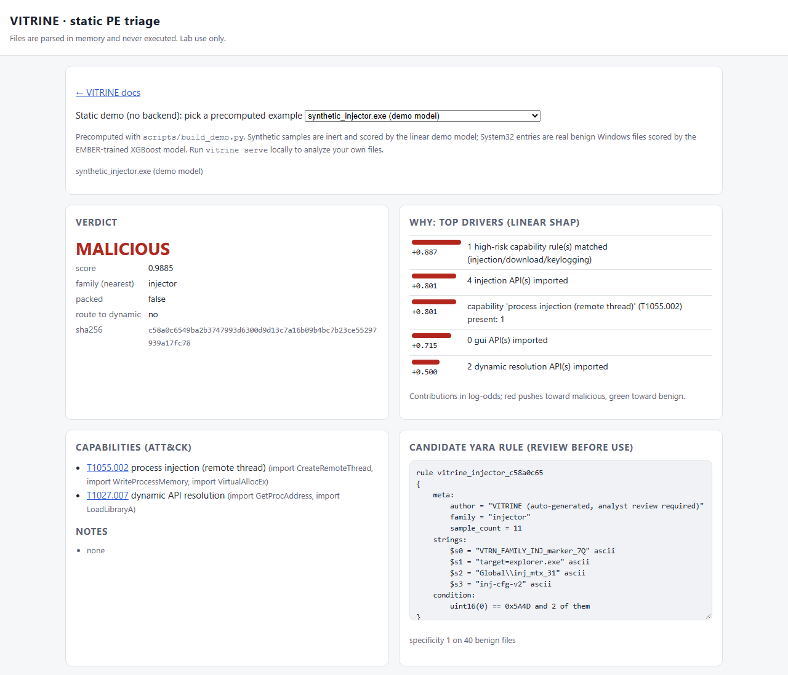

# VITRINE

**Static-first PE triage that explains every verdict and writes a candidate YARA rule, without ever running the sample.**

**Novel contribution:** 91 *named* features make temporal drift measurable and give a ranked hypothesis about its source: a model trained on EMBER 2018 and tested on EMBER2024 loses 0.018 AUC and, at its own calibrated threshold, 29 pt of recall while its false-positive rate falls (silent decay). Among features defined and extracted identically in both datasets, a drift-weighted ranking (correlational) points to benign-side selection shifts (signing size, DLL share) and both-class toolchain shifts (section virtual-size ratio, import count, OS and linker versions, size); 6 of the top 10 survive every binning and family control; dropping them does not recover robustness, and an oracle alignment of their 2018 distributions does not recover the drop but lowers 2024 AUC further, by 0.0166 (0.0130-0.0204), 93 % of the drop's size. The top raw-PSI feature (`n_embedded_mz`) is a schema-definition change ([Evaluation §2](evaluation.md#2-cross-time-ember-2018-ember2024)).

| Headline (95 % CI) | Value |
| --- | --- |
| VITRINE XGBoost, EMBER 2018 test (3 seeds, seed-pooled) | AUC 0.9914 (0.9908-0.9922), 88.2 % (87.8-88.8) TPR @ 1 % FPR |
| vs published EMBER 2018 model (same rows, seed-pooled) | −0.0050 AUC (−0.0056 to −0.0043), −12.8 pt (−14.8 to −11.2) @ 0.1 % FPR **(worse)** |
| 2018 model on EMBER2024 | AUC 0.9730 (0.9710-0.9748), recall at its threshold 88.0 % → 58.6 % |
| Auto-YARA, 15 families | 16.8 % coverage, 5 FPs / 100k benign (filtered imphash baseline 13.9 %, 7) |
| System32 (2,999 real binaries) | 0 false positives (upper bound 0.1 %) |

- **[How it works](how-it-works.md)**: one sample through parse, features, SHAP, rules, triage
- **[Evaluation](evaluation.md)**: methodology, every result, confidence intervals
- **[Reproduce](reproduce.md)**: exact commands, expected outputs, runtimes
- **[Demo](demo/index.html)**: the triage UI with precomputed examples

> **Lab-only, no malware.** VITRINE only reads bytes and never executes a file. All training and evaluation uses EMBER's pre-extracted features (no binaries). See [Security](security.md), [Threat model](threat-model.md) and [ADR 0001](adr/0001-static-only-no-live-malware.md).

Citations for the datasets and prior work are on the [Datasets](datasets.md) page.
